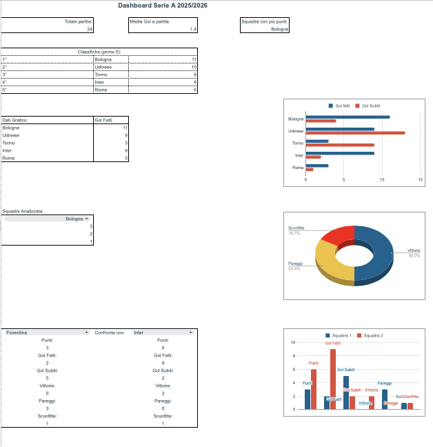

# 📊 Analisi Sportiva Serie A 2025/26

## 🔗 **Apri il file interattivo**
👉 **[Clicca qui per visualizzare la Dashboard](## 📸 Anteprima

)**

> ⚠️ **Nota**: Il file è pubblicato sul web. Per modificarlo:
> 1. Apri il link
> 2. Clicca su **"Apri in Google Fogli"** in alto
> 3. Vai su **File → Crea una copia** e salvalo sul tuo Drive

---

## 📋 **Descrizione del progetto**

Questo progetto contiene un'analisi completa della **Serie A 2025/26**, con dati aggiornati fino alla 10ª giornata. Il file Google Sheets è strutturato in quattro fogli interconnessi che si aggiornano automaticamente.

### ⚽ **Funzionalità principali**

| Foglio | Descrizione |
|--------|-------------|
| **📅 Dati** | Tutti i risultati delle partite con calcolo automatico dell'esito (1/X/2) |
| **🏆 Classifica** | Classifica dinamica con punti, gol fatti/subiti, vittorie, pareggi, sconfitte |
| **📈 Dashboard** | Statistiche interattive, media gol, prime 5 squadre, confronto testa a testa |
| **⚙️ Config** | Info squadre (allenatori, stadi, capacità) e classifica marcatori |

### 🔍 **Cosa puoi fare**
- ✅ Visualizzare la classifica aggiornata in tempo reale
- ✅ Confrontare due squadre (es. Inter vs Milan)
- ✅ Analizzare la media gol per partita
- ✅ Scoprire la squadra con più punti e più spettatori
- ✅ Consultare la tabella marcatori con medie realizzative

---

## 🛠️ **Competenze dimostrate**

| Competenza | Implementazione |
|------------|-----------------|
| **Formule avanzate** | CONTA.PIÙ.SE, SOMMA.PIÙ.SE, CERCA.VERT, INDICE, CONFRONTA, GRANDE |
| **Dashboard interattiva** | Confronto dinamico tra squadre con validazione dati |
| **Automazione** | Classifica che si aggiorna automaticamente inserendo nuovi risultati |
| **Organizzazione dati** | 4 fogli collegati tra loro con struttura professionale |
| **Pubblicazione web** | File pubblicato e accessibile da chiunque senza login |

---

## 📸 **Anteprima**

*Qui puoi aggiungere uno screenshot della tua Dashboard*
*(per aggiungerlo: carica l'immagine su GitHub e usa ``)*

---

## 🚀 **Come utilizzare il progetto**

### Per visualizzare (senza account Google):
1. Clicca sul link in alto
2. Esplora i vari fogli e la dashboard

### Per modificare e personalizzare:
1. Apri il link e clicca **"Apri in Google Fogli"**
2. **File → Crea una copia** (salvalo sul tuo Drive)
3. Aggiungi nuove partite nel foglio **"Dati"**
4. Tutto si aggiornerà automaticamente! ✨

---

## 📊 **Struttura del file**
